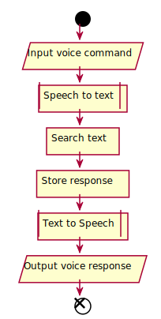

Regular **Markdown** here.

<!--
@startuml
start;
:Input voice command/
:Speech to text|
:Search text]
:Store response]
:Text to Speech|
:Output voice response/
end;
@enduml
-->

Some more markdown.
