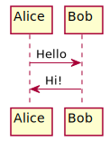

Regular **Markdown** here.

<!--
@startuml
start
:Input voice command;
:Speech to text;
:Search text;
:Store response;
:Text to Speech;
:Output voice response;
stop
@enduml
-->

Some more markdown.
